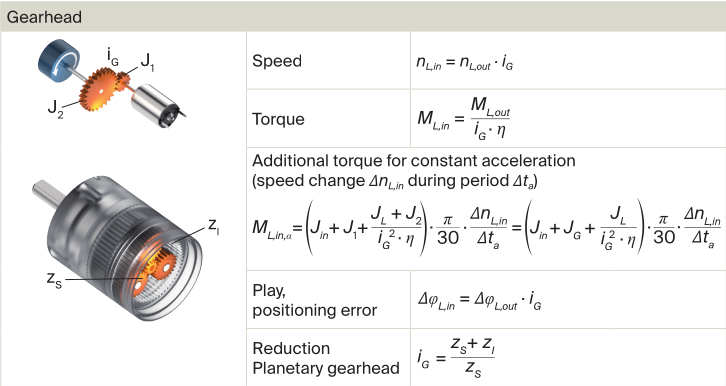

# Cepheus Arm Motor Drivers Configuration

**Motor:** Maxon DCX22L EB KL 24V

**Gear Head:** Maxon GPX26 LZ 186:1

**Driver:** Maxon ESCON 36/2 DC 403112

**Guide:** How to configure an Escon controller - Maxon Technical Paper

**Formulas:** Selection of DC Drives, Guideline with Calculations - Maxon.pdf

**Project:** Cepheus Planar Space Emulator  

**ROS:** ROS1  

**Last validated:** 2025-12-11

## Datasheet Info

For the purposes of configuring the motor drivers correctly we have the following from the datasheets:

| Item | Parameter | Symbol | Value | Notes |
| --- | --- | --- | --- | --- |
| Motor | No load current | $I_{o}$ | 10.2 mA | For calculations |
| Motor | Nominal current | $I_{nom}$ | 0.655 A | For driver config |
| Motor | Nominal torque |  | 29.2 Nm | For reference |
| Motor | Stall current | $I_{stall}$ | 3.31 A | Absolute max |
| Motor | Torque constant | $K_{τ}$ | 0.0452 Nm/A | For calculations |
| Motor | Speed constant | $K_{v}$ | 211 rpm/V | For driver config |
| Motor | Max permissible speed |  | 7160 rpm | For driver config |
| Motor | Thermal time constant of the winding |  | 22 s | For driver config |
| Gearhead | Ratio | $G$ | 186:1 (185.93) | For calculations |
| Gearhead | Max efficiency | $η_{max}$ | 75% | For calculations |
| Gearhead | Max Continuous Torque | $T_{out_{cont-max}}$ | 4.5 Nm | For calculations |
| Gearhead | Max Intermittent Torque | $T_{out_{int-max}}$ | 6.2 Nm | For reference |
| Gearhead | Max input speed |  | 10,000 rpm | For  reference |
| Gearhead | Average Backlash no load |  | 0.9 deg | For reference |

# Driver Configuration

Configuration is done with ESCON STUDIO and the driver is set to Current Control with no Encoder. The following are required by the setup:

- Maximum Permissible Speed
- Thermal Time Constant of Winding
- Nominal Current
- Max Output Current Limit

## Maximum Permissible Speed

According to the guide, the factors that can limit the maximum permission speed are:

- Maximum controller speed (N/A)
- Number of pole pairs (1)
- Maximum permissible speed of the motor (7,160 rpm)
- Maximum continuous input speed of the gearhead (10,000 rpm)
- Maximum speed of the load (N/A)
- Speed constant of the motor (211 rpm / V)
- Available voltage from the power supply (assumed sufficient)

We select 7,160 rpm as an upper limit.

## Thermal Time Constant of Winding

According to the guide, the speed constant, Thermal Time Constant Winding, and Number of Pole Pairs settings are to be taken directly from the datasheet of the motor (lines 13, 19, 29).

## Nominal Current & Max Output Current Limit

According to the guide, the Nominal Current is taken directly from the motor datasheet (line 6). As for the Max. Output Current Limit it can be limited by the following:

- Nominal torque of the motor (29.2 Nm)
- Maximum output torque of the gearhead (continuous 4.5 Nm, intermittent 6.2Nm)
- Available torque of  the overall system (assumed sufficient)
- Ambient Temperature
- Current required for acceleration/deceleration.

A maximum of output current of twice the nominal current is typically recommended. This is to account for the acceleration current.

The gearhead limited continuous current is given by:

$$
I_{gear_{cont}} = \dfrac{T_{out_{cont-max}}}{K_τ \times G \times η_{max}}
$$

> Important to note for modeling this, is that the efficiency of the gearhead (3 stage planetary ~90% efficiency each) is torque dependent. It can be roughly approximated at 55% at 0 - 1 Nm, 65% at 1 - 3 Nm and 75% at 3 - 4.5 Nm.
> 

$$
I_{gear_{cont}} = \dfrac{4.5}{0.0452 \times 186 \times 0.75} \approx 0.714 \ A
$$

and the intermittent:

$$
I_{gear_{int}} = \dfrac{T_{out_{int-max}}}{K_τ \times G \times η_{max}}
$$

$$
I_{gear_{int}} = \dfrac{6.2}{0.0452 \times 186 \times 0.75} \approx 0.983\ A
$$

So a safe limit for the max output current limit is $0.8 A$. The maximum torque produced is:

$$
T_{out_{max}} = I_{max} \times K_t \times G \times η
$$

$$
T_{out_{max}} = 0.8 \times 0.0452 \times 186 \times 0.75 \approx 5.04 \ Nm
$$

## Summary

So the configuration parameters for the driver are: 

| Parameter | Value |
| --- | --- |
| Speed Constant | 211 rpm / V |
| Thermal Time Constant of the Winding | 22 s |
| Max permissible Speed | 7160 rpm |
| Nominal Current | 0.655 A |
| Max Output Current Limit | 0.8 A |

At those settings a PWM control signal at 10% duty cycle delivers 0 A to the motor and 90% duty cycle delivers 0.8 A

## Regulation Tuning

After setting the parameters above it is mandatory to perform the “Regulation Tuning” option on ESCON Studio. This is done with the motors on the arms and the robot on the granite table. 

During Regulation Tuning, the ESCON measures the motor’s real electrical characteristics (resistance, inductance, wiring effects) instead of relying on datasheet values.

It then computes and adjusts the internal PI current-control gains to achieve fast, stable, and accurate current tracking.

Finally, it validates the loop by applying small test currents and ensuring the system is stable, producing a joint-specific “Gain” value for that actuator.

Below is gain logger:

| **Gain** | 18/11/25 |  |  |  |  |
| --- | --- | --- | --- | --- | --- |
| Shoulder | 1680 |  |  |  |  |
| Elbow | 1667 |  |  |  |  |
| Wrist | 1645 |  |  |  |  |
| Notes | First Tuning |                                                                                             |  |  |  |

## Manual Adjustments

### PI Current Controller Gain

Manual adjustment is only needed if we observe overshoot, audible buzzing, or slow current response after tuning—raising the gain makes torque response faster but riskier, while lowering it trades speed for stability.

- **Higher gain** → **faster** current response, **sharper** torque changes, can feel **jerkier** or more “snappy,” and may introduce buzzing if too high.
- **Lower gain** → **slower** current response, **smoother** motion, but can feel **sluggish** and may under-deliver torque on fast commands.

### Current Offset

The current offset should only be adjusted to correct true electrical bias in the current measurement.

After Regulation Tuning, verify that a zero command produces zero measured current; if the ESCON reports a small positive or negative bias (e.g., ±0.02–0.05 A), the offset can be trimmed so that the motor produces no residual torque at zero input. Manual offset adjustment is *not* used to compensate friction, dead zones, or starting thresholds—those effects belong in the joint friction model or the controller, not in the ESCON’s electrical zero-trim.

# Current Formula

The motor current is given by:

$$
I_{in}(τ) = I_0 + \dfrac{τ}{K_τ \times G \times η_g(τ)} 
$$

where:

- $τ$ is the joint torque
- $I_0$ is the no load current of the Motor (10.2 mA)
- $K_τ$ is the the Torque Constant of the Motor (211 rpm / V)
- $G$ is the gearhead reduction ratio (186)
- $η_g(τ)$ is the gearhead efficiency a function of torque
- $η_m(τ)$ is the motor efficiency as a function of torque

The no-load current $I_0$ represents the electrical current needed to overcome the motor’s internal friction, iron losses, and brush/commutation losses at zero external load. Even when no torque is delivered to the output, the motor requires $I_0$ to rotate, and this current produces a corresponding “loss torque” $M_0 = k_T I_0$ For low-torque, low-speed applications like ours, this term is important because it dominates the behavior near zero torque.

## Gearhead efficiency

The gearhead efficiency is torque-dependent and peaks around 75% near the rated continuous torque (4.5 Nm). It is approximated by the following equation.

$$
η_g(τ) = \frac {τ}{\frac {τ}{η_{max}} + G \times (M_{VA}+c_5 \times n_{in})}
$$

where:

- $M_{VA}$ is the static damping (loss torque) (0.3 mNm ±50%)
- $c_5$  is the viscous damping (loss torque) (56.3 nNm / rpm ±50%)
- $n_{in}$ is the motor speed (gearhead input)

In our operating range (0–1 Nm at the joint) and using a representative motor speed of $n_{in} ≈ 1000 rpm$, the model gives:

- $η_g(0.1 Nm) ≈ 0.50$
- $η_g(0.5 Nm) ≈ 0.68$
- $η_g(1.0 Nm) ≈ 0.72$

These results show that using a constant $η_g ≈ 0.65$ is a solid approximation for controller design within the 0–1 Nm region, while the full expression above should be used in simulation for more accurate power-loss modeling.

The residual error is absorbed by the identified joint-level gain K_eff and friction model.

## Backlash Compensation

The gearhead exhibits a significant no-load backlash of approximately **0.9°**, which introduces a deadband where small torque reversals produce no output motion. This nonlinearity severely affects model-based controllers unless it is explicitly addressed. 

In simulation, backlash is modeled as a simple hysteresis element: when the motor-side angle lies within a deadband $β \approx 0.9^o = 0.9 \times π\ /\ 180 \approx 0.0157 \ rad$, the output shaft angle remains unchanged; once the deadband is exceeded, the output engages with an offset of $±β/2$.

On the real system, a practical strategy is to apply a small **preload torque** so the gears remain engaged on one side, preventing oscillations and chatter inside the backlash gap. This approach preserves controller stability while capturing the dominant backlash effects in the plant model.

The static friction at the joint is calculated by adding the motor and gearhead static damping. Maxon provided the following:

$$
M_{VA,m} = 0.25\ mNm \pm33\% ,\ M_{VA,g} = 0.30\ mNm \pm50 \%
$$

$$
M_{VA,tot} = M_{VA,m} + M_{VA,g} = 0.00055\ mNm
$$

Reflected to the joint:

$$
τ_{fric,joint} \approx M_{VA,tot} \cdot G \cdot η_g = 0.067\ Nm
$$

To be safe against tolerances we pick 1.5-2x that. So we will use a torque bias of:

$$
τ_{bias}= 0.12\ Nm
$$

## Implementation in Software

For software use the expression is:

$$
I_{in}(τ) = I_0 + I_{bias} + \dfrac{τ}{K_τ \times G \times η_g(τ)}  = 0.0102 + \dfrac{τ}{0.0452 \times 185.93 \times 0.65}
$$

$$
I_{in}(τ)= τ\  / \ 5.4626234 + 0.0102
$$

Backlash torque adjustment in deadband:

$$
τ = \begin{cases}  τ_{cmd} + τ_{bias}  &  |τ_{cmd}| < τ_b \\
  τ_{cmd}  & otherwise
\end{cases},\ τ_b = 0.15 \ Nm,\ τ_{bias} = 0.12\ Nm
$$

# Reference Formulas

